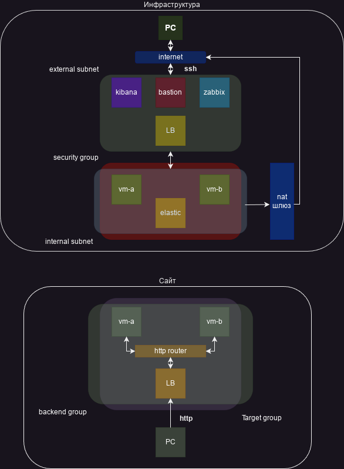

# Дипломная работа по профессии «Системный администратор» Воронин Владислав

## Содержание

* [Задача](#Задача)
* [Схема](#Схема)

## Задача

Ключевая задача — разработать отказоустойчивую инфраструктуру для сайта, включающую мониторинг, сбор логов и резервное копирование основных данных. Инфраструктура должна размещаться в [Yandex Cloud](https://cloud.yandex.com/) и отвечать минимальным стандартам безопасности: запрещается выкладывать токен от облака в git.

## Схема

