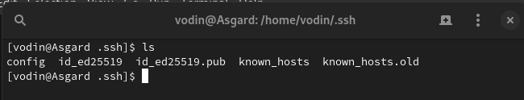
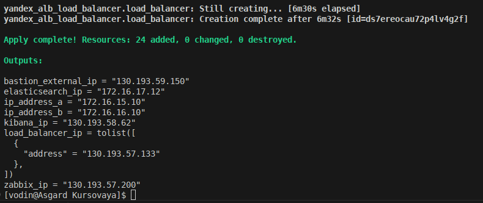
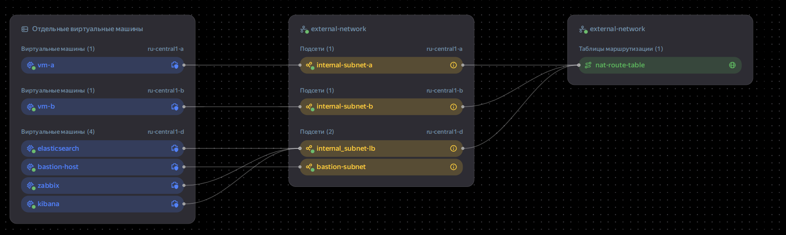
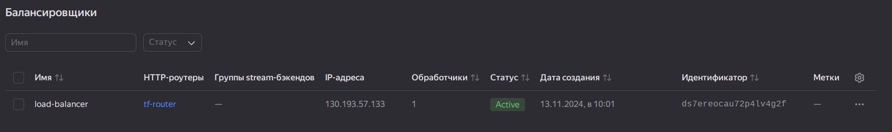
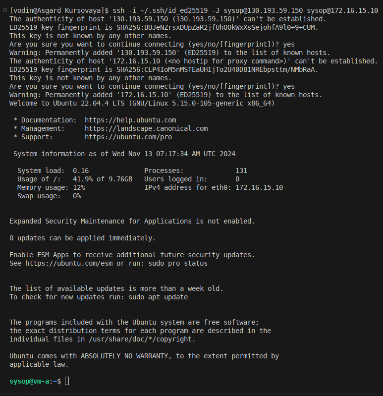
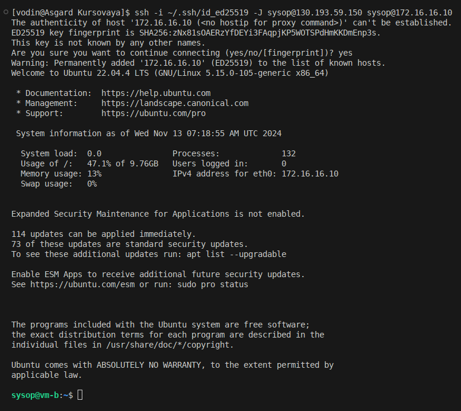

# Дипломная работа по профессии «Системный администратор» Воронин Владислав

## Задача

Ключевая задача — разработать отказоустойчивую инфраструктуру для сайта, включающую мониторинг, сбор логов и резервное копирование основных данных. Инфраструктура должна размещаться в [Yandex Cloud](https://cloud.yandex.com/) и отвечать минимальным стандартам безопасности: запрещается выкладывать токен от облака в git.

## Примерная схема инфраструктуры

## Создание инфраструктуры

Перед началом сформированы ssh ключи:

Далее развернут Terraform и с помощью него созданна инфраструктура:

Провайдер:

Задаём параметры провайдера для yandex-cloud в [main.tf](https://), объявляем переменные параметров провайдера в [variables.tf](https://), задаём значения в variables.auto.tfvars и вносим его в gitignore.

**Сеть:**

Созданна основная сеть в [networks.tf](https://), две подсети в разных зонах доступности для вм, NAT шлюз и маршрутная таблица, подсеть для балансировщика, подсеть для бастионного хоста, резервируем статический ip для  бастионного хоста.

**Целевая группа:**

Создаём целевую группу для балансировщика [gr_terget.tf](https://), вносим в неё сети и подсети вм.

**Бэкенд группа:**

Создаём группу для бэкенда в [gr_backend.tf](https://), добавляем целевую группу и проверку http

**Группа безопасности:**

Создаём группу безопасности в [gr_secure.tf](https://), включаем в неё ресурсы и подсети и прописываем правила для доступа.

**Балансер:**

Создаём балансер в [alb.tf](https://), включаем в группы, прописываем зоны и listener.

**ВМ:**

Создаём виртуальные в [vm.tf](https://) машины для всех ресурсов, включаем в группы и подсети, назначаем ip, прописываем метаданные в [meta.yaml](https://)

**Выводы:**

Прописываем выводы адресов ресурсов в [outputs.tf](https://)

**Проверка:**

Форматируем код `terraform fmt`, проверяем валидацию кода `terraform validate`, предварительно запускаем планировщик `terraform plan`, делаем `terraform apply --auto-approve` в облако.

На данном этапе проверяем подключение по ssh через бастион к вм:

