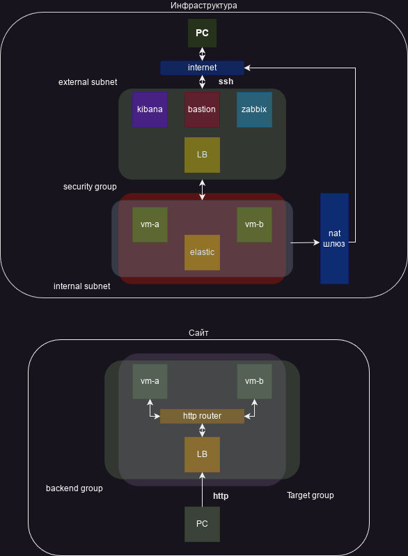
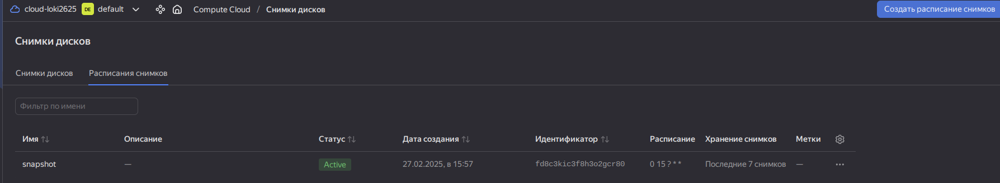
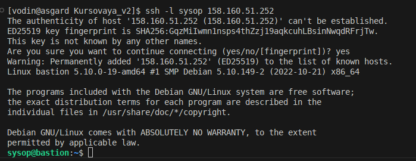

# Дипломная работа по профессии «Системный администратор» Воронин Владислав

## Задача

Ключевая задача — разработать отказоустойчивую инфраструктуру для сайта, включающую мониторинг, сбор логов и резервное копирование основных данных. Инфраструктура должна размещаться в [Yandex Cloud](https://cloud.yandex.com/) и отвечать минимальным стандартам безопасности: запрещается выкладывать токен от облака в git.

## Примерная схема инфраструктуры

## Создание инфраструктуры

Перед началом сформированы ssh ключи:

*Инстансы пересоздавались несколько раз, поэтому адреса на скринах могут не совпадать.

*Некоторые файлы типо meta.yaml, terraform.tvars я добавил в gitignor для соблюдения безопасности.

Далее развернут Terraform и с помощью него созданна инфраструктура:

**Провайдер:**

Задаём параметры провайдера для yandex-cloud в [main.tf](https://), объявляем переменные параметров провайдера в [variables.tf](https://), задаём значения в variables.tfvars и вносим его в gitignore.

**Сеть и группы:**

Созданна основная сеть в [network.tf](https://), две подсети в разных зонах доступности для вм, NAT шлюз и маршрутная таблица, подсеть для балансировщика, подсеть для бастионного хоста. Используем [variables.tf](https://),  [locals.tf](https://),  [terraform.tfvars](https://) для реализации цикла for_each при создании подсетей. В этом же файле декларированны целевые группы с нужными планами из задания.

**Виртуальные машины:**

В файле [vms.tf](https://) декларированны сздаваемые ресурсы. Бастион хост  с внешней сетью и внутренней подъсетью, два вэб сервера в разных зонах доступности только с внутренней сетью, zabbix, elastic, kibana с внешними ip.

**Выводы:**

Прописываем выводы адресов ресурсов в [outputs.tf](https://)

**Бэкапы:**

В файле [snapshot.tf](https://) настроенна система резервного копирования.

**Проверка и запуск Terraform:**

Инициализируем Terraform `terraform init`. Форматируем код `terraform fmt`, проверяем валидацию кода `terraform validate`, предварительно запускаем планировщик `terraform plan`, делаем `terraform apply --auto-approve` в облако.

После развёртования инфраструктуры проверяем установленные инстансы через консоль:

`yc compute instance list`

На данном этапе проверяем подключение по ssh через бастион к вм:

Проверяем связь ansible с хостами при помощи модуля ping и [hosts.yaml](https://)

**Настройка NGINX:**

Создаём [web-playbook.yml](https://) в role прописываем index.html конфиги и задачи для установки NGINX.

Запускаем его:

`ansible-playbook -i hosts.yml web-playbook.yml --limit webservers`

**Настройка Elastic:**

Для этого создаём [elastic-playbook.yml](https://) в ролях прописываем установку docker через `comunity.docker` перед этим установив к себе коллекцию:  `ansible-galaxy collection install community.docker` , так как работа Elastic реалезованна через docker container.

Настройка Kibana:

Так же запускаеь через контейнер с помощью [kibana-playbook.yml](https://) и соответствующих ролей

Установка [Filebeat ](https://)на вэб сервера. В конфигу настраиваем отправку логов nginx в Elasticsearch.

Настройка Zabbix:

Настраиваем и конфигурируем zabbix запускаем [zabbix_server-playbook.yml](https://)

Далее устанавливаем агента на все ВМ, для этого запустим [zabbix_agent-playbook.yml](https://)

